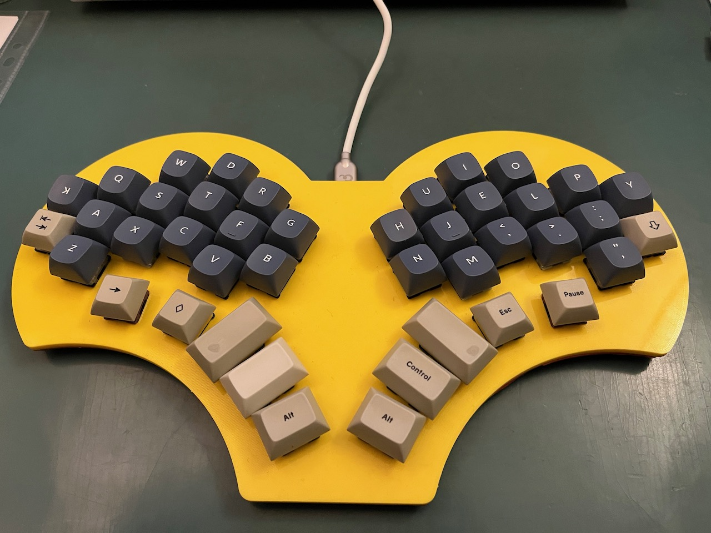
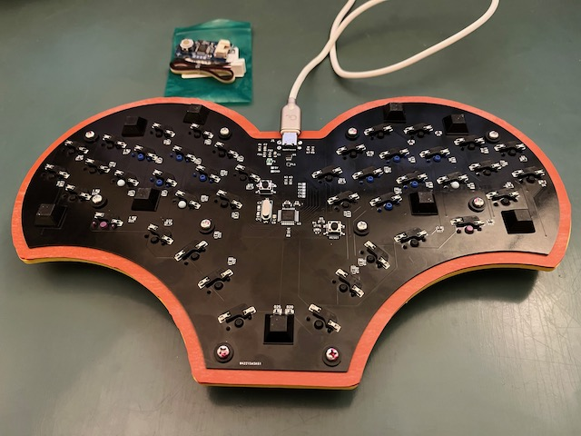

# Acacia keyboard

A custom built mechanical keyboard with just 40 keys plus two extra media keys.

The [layout](acacia.pdf) uses three layers.  One for alphas, one for navigation/function-keys, and one for symbols/numpad.

The lower thumb keys are one-shot modifiers (shift, alt, alt, control), but can also be held.  The two upper thumb keys are regular keys when tapped (delete, backspace, space, escape), but modifiers when held (gui, symbol layer, navigation layer, altgr).  When one layer key is held, then the opposite layer key becomes a modifier (control or gui).  If used on macOS, then the Control and GUI (Command) keys should be swapped at the OS level.

I seem to have settled on a [Minimak-4](http://www.minimak.org/) layout for the alpha keys, see the pictures.  It is so close to standard QWERTY that changing between the two is not a problem, and it works very well with the T (and Y) key relocation on Acacia.

## Improvements

- Adjust the thumb keys slightly to make sure the keycaps to not collide.  Also, the home thumb key could be a little less tilted.
- Align Q and P keys with ring finger use (instead of pinkie use).
- Include a trackball (as alluded to in the pictures).  Unfortunately the ATmega32U2 used in the build does not have built-in I2C communication, so unless the controller is upgraded to eg. ATmega32U4, the communication has to be done brute-force through some of the five unused GPIO pins.
- Make a proper (wooden) case.
