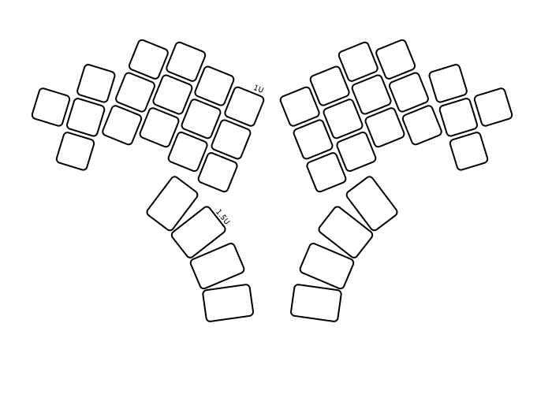
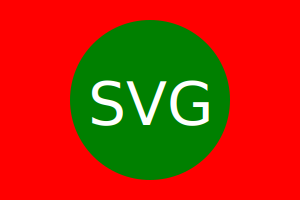

# Custom Keyboard

Goals
- Good ergonomics
- Good for programming
- No drivers
- Configurable
- Use standard components where possible

On the ergonomics side, the initial design will be a split staggered-column because it follows the natural physiology of the hands, and because I only need to make one or two for myself.  I want to make a PCB for the keyboard, so it seems to convoluted to go all the way to curved surfaces (eg. wells).  With a PCB, I can also support hot-swappable keys, which makes it possible to try out different spring weights for the individual fingers (like the [Absolem](https://zealot.hu/absolem/)).  And no stabilisers should be needed because the keys should just be where your finger naturally lands, and therefore there should be no need for large 2U keys.  For the thumb keys, size 1.5U is probably sufficient.

Good ergonomics with no curvatures then means that the number of keys must be limited to avoid stretching the fingers too much.  Which means that the keyboard needs to have several layers to accommodate all the ASCII characters used in programming, as well as the various European letters I use daily.  I am toying with the idea of using the thumb keys exclusively for layer-shift and control keys.

The keyboard should use standard hot-swappable Cherry MX keys.  And to ease experimentation, I will start out with DSA profile key caps.

## Layers

The keys in somewhat order of importance:

1.  Lower-case ASCII letters (`abc`...`z`)
1.  White space (Blank, Tab, Enter)
1.  Backspace, Delete, Escape
1.  Punctuation symbols (`,.;:'"!?()`)
1.  Programming symbols (`/~\`|+=-_\\@#$%^&*[]{}`)
1.  Upper-case ASCII letters (`ABC`...`Z`)
1.  Digits (`01`...`9`)
1.  Modifier keys (Ctrl, Alt, Command/Menu/Win)
1.  Cursor position manipulation (Arrow keys, Page Up, Page Down, Home, End)
1.  Lower-case European letters
1.  Upper-case European letters
1.  Function keys (F1 ... F12)
1.  Media keys (Play/Pause, Next, Previous, Volume Up, Volume Down)

Also, I prefer that each group of keys follows the traditional QWERTY layout, simply because it makes switching between keyboards less stressful.

The raw layout of keys:

