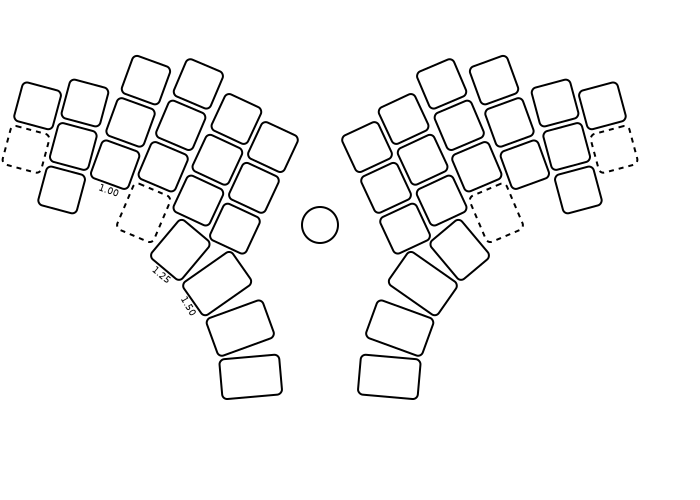

# Custom Keyboard

Goals
- Good ergonomics
- Good for programming
- No drivers
- Configurable
- Use standard components where possible

On the ergonomics side, the initial design will be a split staggered-column because it follows the natural physiology of the hands, and because I only need to make one or two for myself.  I want to make a PCB for the keyboard, so it seems to convoluted to go all the way to curved surfaces (eg. wells).  With a PCB, I can also support hot-swappable keys, which makes it possible to try out different spring weights for the individual fingers (like the [Absolem](https://zealot.hu/absolem/)).  And no stabilisers should be needed because the keys should just be where your finger naturally lands, and therefore there should be no need for large 2U keys.  For the thumb keys, size 1.5U is probably sufficient.

Keys that need to be hold down while pressing other keys should only be operated by strong fingers. So all modifier keys and layer shifting should probably be in the thumbs area, where it will be most comfortable to hold down a keys (as opposed to tapping the key).  But some modifier keys need to be hold down together, so these modifiers then need to be on opposite sides, using both thumbs at the same time.  Indeed, some common text-editor commands need Shift, Control and Alt pressed down at the same time, so it should be possible to Control and Alt with just one thumb.  

Good ergonomics with no curvatures then means that the number of keys must be limited to avoid stretching the fingers too much.  Which means that the keyboard needs to have several layers to accommodate all the ASCII characters used in programming, as well as the various European letters I use daily.  I am toying with the idea of using the thumb keys exclusively for layer-shift and control keys.

The keyboard should use standard hot-swappable Cherry MX keys.  And to ease experimentation, I will start out with DSA profile key caps.

## Layers

Contexts:

  1.  Programming (standard languages) in non-modal text editor.
  1.  Documentation (Markdown) in non-modal editor.
  1.  Terminal (shell) operations.
  1.  Window manager navigation.
  1.  Music control (easy identification of Play/Pause key at a glance)

And:

- Function keys are important in my text editor.
- Editor usually inserts ending parenthesis/brace/bracket automatically.
- I don't care about RGB LEDs, as long as I can turn them off.
- I use Nordic/German/Greek letters when writing text.
- I want modifiers and layer keys on thumbs, and they should stay in the same place as much as possible.

Also, I prefer that each group of keys follows the traditional QWERTY layout, simply because it makes switching between keyboards less stressful.

## V1

The raw layout of keys:

The middle ring is a track ball.  The outlined rectangular keys are optional.  The round outlined shapes (not shown) are not actual keys, but OS-switch and debug buttons.

There are four keys for each thumb.  Each thumb key has a one-shot function and a held-down function, denoted as OneShot/HeldDown:

| Left           | Right |
| ----           | ----- |
| Delete/Control | Escape/Control |
| Backspace/Alt  | Space/Navigate |
| Tab/GUI        | Enter/Symbols |
| (1shot)AltGr   | (1shot)Shift |

### Problems

- General: dash cumbersome, swap gui/ctl stochasticly -> needs real switch
- Sublime: C-A-up (switch header), C-A-ping (update docstring), A-BS (delete word), S-G-z (macOS redo), W-ping (console), C-/ (comment selection)
- WM: (none)
- Terminal: (none)

